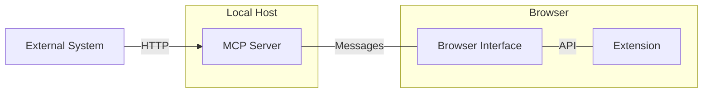
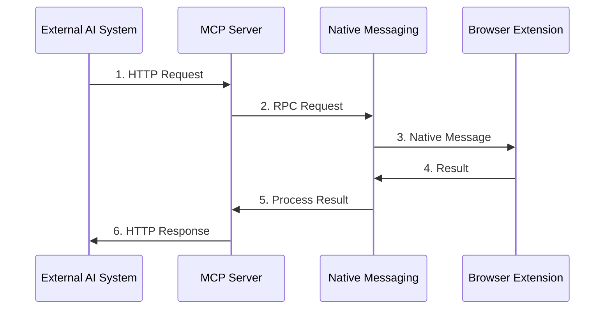

# Chrome Native Messaging Host for MCP

## 1. Overview

The MCP (Model Context Protocol) service in Nanobrowser provides an interface for AI systems to interact with browsers through:

- Browser resources: DOM, page state, and other browser information
- Browser tools: Navigation, element interaction, and other operations

Key components:
- **MCP Server**: Implements protocol and handles external requests
- **Browser Extension**: Executes browser operations and provides state information
- **Native Messaging**: Secure communication between server and extension

Communication architecture:
1. **External Layer**: AI systems → MCP server via HTTP requests
2. **Internal Layer**: MCP server → Browser extension via Chrome Native Messaging

## 2. System Architecture

Component responsibilities:

- **External AI System**: Sends MCP requests, processes responses
- **MCP Server**: Converts between MCP protocol and browser commands
- **Browser Interface**: Handles native messaging communication
- **Browser Extension**: Executes operations in the browser

## 3. Core Components and Flows

### 3.1 Core Components

- **NativeMessaging**: Handles low-level communication with the browser extension
- **McpServerManager**: Manages the MCP server and HTTP transport
- **Resources**: CurrentDomResource, CurrentStateResource
- **Tools**: NavigateToTool, RunTaskTool

### 3.2 Data Flow

### 3.3 Resource Access Process

1. External system requests a browser resource
2. MCP server identifies the requested resource and calls handler
3. Resource handler uses Native Messaging to request from browser
4. Browser extension gathers and returns requested information
5. MCP server formats and returns the resource to external system

### 3.4 Tool Execution Process

1. External system calls a browser tool with parameters
2. MCP server validates and sends command to browser
3. Browser extension executes operation and captures result
4. Result is returned through the communication chain to external system

## 4. Security Model

Key security measures:
- MCP server listens only on localhost
- Native messaging restricted to authorized extensions
- Input validation on all requests
- Local-only communication for sensitive operations

## 5. Summary

The Chrome Native Messaging Host for MCP provides a secure bridge between external AI systems and browser functionality through:
- Standardized interfaces via MCP protocol
- Secure communication channels using Native Messaging
- Clear separation between external requests and browser operations
