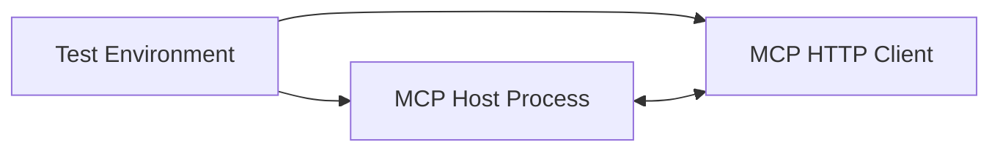

# MCP Host Integration Testing

## Test Architecture

The integration tests use a three-part approach:



- **Test Environment**: Controls the test process and provides mock data
- **MCP Host Process**: The actual host under test
- **MCP HTTP Client**: Simulates external MCP clients

## Core Components

### McpHostTestEnvironment

The central component that:
- Manages the lifecycle of the MCP Host process
- Provides both stdio and HTTP interfaces for testing
- Handles message and RPC registration

```typescript
// Key functionality:
async setup() 
async cleanup()
async sendMessage(message)
registerMessageHandler(type, handler)
registerRpcMethod(method, handler)
```

### McpHttpClient

Client for testing the HTTP interface:
- Connects to the MCP server
- Sends MCP protocol requests
- Validates responses

## Test Scenarios

### Process Lifecycle Tests

Tests for process initialization and shutdown:
- Starting the process
- Establishing communication
- Clean shutdown

### Browser State Tests

Tests for browser state resources:
- Setting mock browser state
- Retrieving state through MCP resources
- Validating resource content

Example:
```typescript
test('should expose browser state as MCP resource', async () => {
  // Register handler for browser state requests
  testEnv.registerRpcMethod('get_browser_state', async (request) => {
    return {
      result: {
        activeTab: {
          url: 'https://example.com',
          title: 'Test Page'
        }
      }
    };
  });

  // Initialize MCP client and read resource
  await mcpClient.initialize();
  const resource = await mcpClient.readResource('browser://current/state');
  
  // Validate content
  expect(JSON.parse(resource.contents[0].text).activeTab.url)
    .toBe('https://example.com');
});
```

### Tool Execution Tests

Tests for executing browser tools:
- Tool registration
- Parameter validation
- Execution and result handling

### Error Handling Tests

Tests for error conditions:
- Invalid messages
- Protocol violations
- Resource not found
- Tool execution failures

## Test Implementation

The tests use Vitest with the following approach:

1. Before each test:
   - Create test environment
   - Start MCP host process
   - Set up message handlers

2. During test:
   - Register mock handlers as needed
   - Use HTTP client to interact with MCP server
   - Verify responses

3. After each test:
   - Clean up resources
   - Terminate MCP host process

## Parallel Testing

The tests are designed to run in parallel:
- Each test environment uses a unique port
- Test environments are isolated from each other
- Port allocation is handled automatically
